# Engineering Concepts - Learning Summary

## Part 1: Algorithms & Data Structures

### Exercise 1 - Inventory Management System

#### Data Structure Comparison
```mermaid
graph TD
    A[Inventory System] --> B{Choose Data Structure}
    B -->|Fast lookups by ID| C[HashMap]
    B -->|Ordered iteration| D[ArrayList]
    B -->|Sorted data| E[TreeMap]
    
    C --> F[O(1) get/put]
    D --> G[O(1) index access]
    E --> H[O(log n) operations]
```

#### Product CRUD Operations
```mermaid
flowchart LR
    P[Product] --> O{Operations}
    O --> Add[addProduct - O(1) HashMap / O(n) ArrayList]
    O --> Upd[updateProduct - O(1) HashMap]
    O --> Del[deleteProduct - O(1) HashMap / O(n) ArrayList]
    O --> Get[getProduct - O(1) HashMap / O(n) ArrayList]
```

---
### Exercise 2 - E-commerce Search Function

#### Big O Complexity Graph
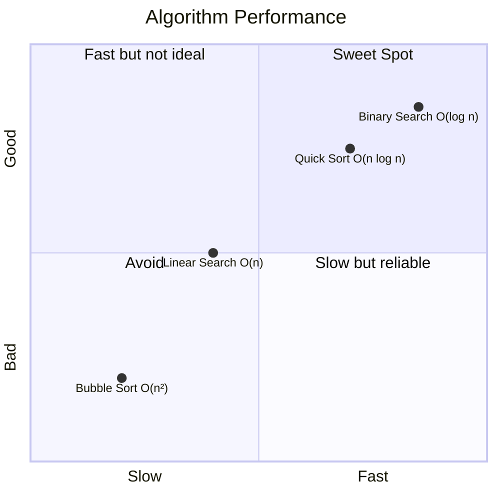

#### Linear vs Binary Search
```mermaid
graph LR
    subgraph Linear Search O(n)
        A1[Array: 3, 7, 1, 9, 4, 2, 8] --> A2[Check each element one by one]
        A2 --> A3["Found? Worst case: check ALL n elements"]
    end
    
    subgraph Binary Search O(log n)
        B1[Sorted: 1, 2, 3, 4, 7, 8, 9] --> B2["Check middle → discard half"]
        B2 --> B3["Repeat: n → n/2 → n/4 → ... O(log n)"]
    end
```

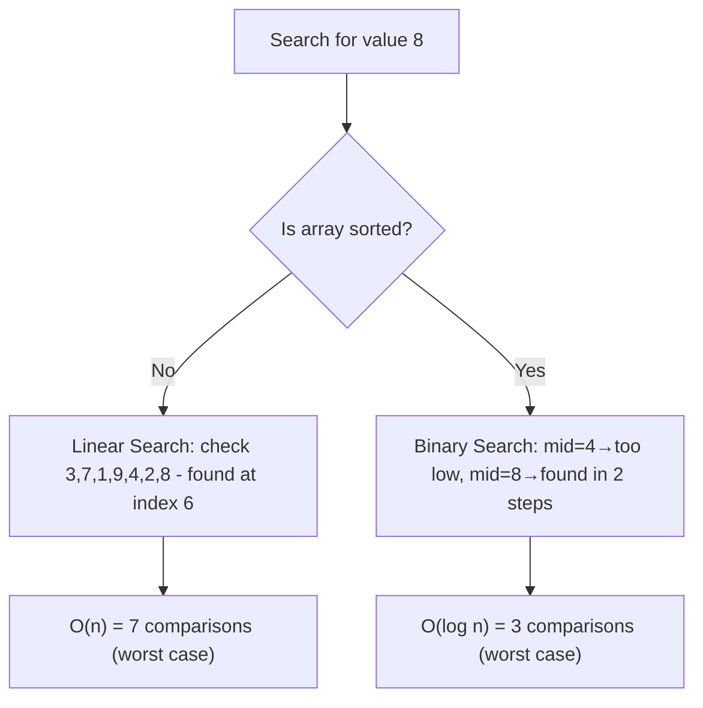

---
### Exercise 3 - Sorting Customer Orders

#### Bubble Sort vs Quick Sort
```mermaid
graph TD
    subgraph Bubble Sort O(n²)
        A["[5, 3, 8, 1]"] --> A1["Compare 5>3 → swap → [3,5,8,1]"]
        A1 --> A2["Compare 5<8 → no swap → [3,5,8,1]"]
        A2 --> A3["Compare 8>1 → swap → [3,5,1,8]"]
        A3 --> A4["Repeat passes until sorted"]
        A4 --> A5["n passes × n comparisons = O(n²)"]
    end
    
    subgraph Quick Sort O(n log n)
        B["[5, 3, 8, 1, 2]"] --> B1["Pick pivot (e.g., 5)"]
        B1 --> B2["Partition: [3,1,2] < 5 < [8]"]
        B2 --> B3["Recursively sort left & right"]
        B3 --> B4["Divide & conquer: O(n log n)"]
    end
```

#### Sorting Algorithm Performance
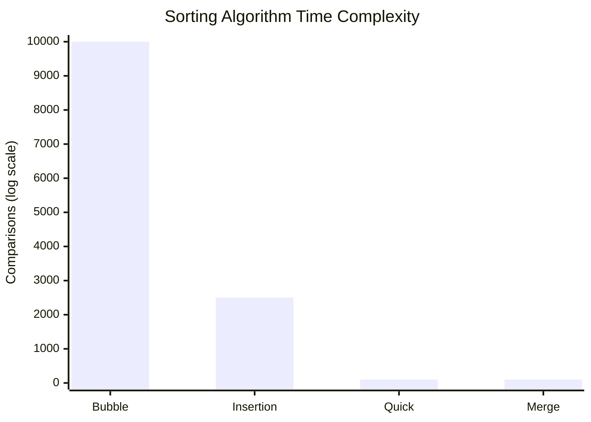

---
### Exercise 4 - Employee Management System

#### Array Memory Representation
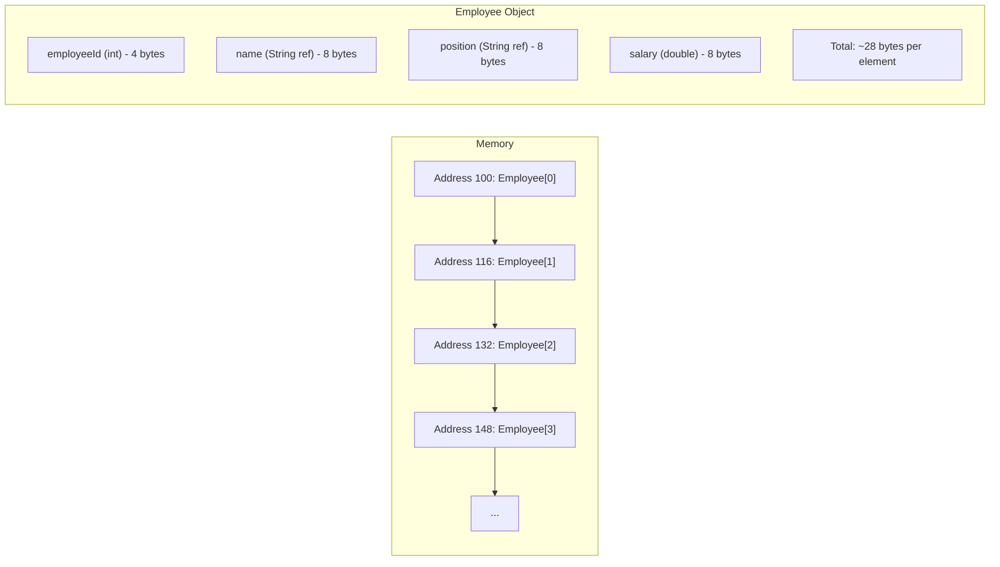

#### Array Operations Complexity
```mermaid
flowchart TD
    A[Array Operations] --> B[Access by index: O1 - O(1)]
    A --> C[Search unsorted: On - O(n)]
    A --> D[Insert at end: O1 - O(1)]
    A --> E[Insert at middle: On - O(n)]
    A --> F[Delete: On - O(n)]
    
    style B stroke:#090,stroke-width:2px
    style C stroke:#990,stroke-width:2px
    style D stroke:#090,stroke-width:2px
    style E stroke:#900,stroke-width:2px
    style F stroke:#990,stroke-width:2px
```

---
### Exercise 5 - Task Management System (Linked Lists)

#### Singly Linked List
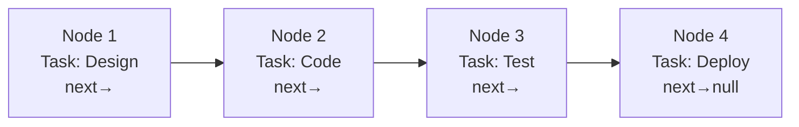

#### Doubly Linked List
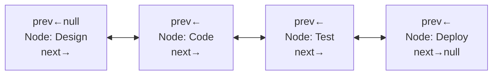

#### Array vs Linked List Comparison
```mermaid
flowchart TD
    C{Array vs LinkedList} -->|Array| A1[Fixed size]
    C -->|LinkedList| L1[Dynamic size]
    C -->|Array| A2[O(1) random access]
    C -->|LinkedList| L2[O(n) sequential access]
    C -->|Array| A3[O(n) insert/delete]
    C -->|LinkedList| L3[O(1) insert at head]
    C -->|Array| A4[Memory contiguous]
    C -->|LinkedList| L4[Memory scattered]
```

---
### Exercise 6 - Library Management System (Search)

#### Search Decision Tree
```mermaid
flowchart TD
    A[Search books by title] --> B{Collection size?}
    B -->|Small < 100| C[Linear Search OK]
    B -->|Large > 100| D{Is data sorted?}
    D -->|Yes| E[Binary Search - O(log n)]
    D -->|No| F[Sort first, then binary search OR linear search]
    
    C --> G[Simple, no preprocessing needed]
    E --> H[Fast! 1000 items → 10 comparisons]
    F --> I[Sort O(n log n) + Search O(log n)]
```

```mermaid
xychart-beta
    title "Comparisons: Linear vs Binary Search (n=1000)"
    x-axis ["Best Case", "Average", "Worst Case"]
    y-axis "Comparisons" 0 --> 1000
    bar [1, 500, 1000]
    bar [1, 10, 10]
```

---
### Exercise 7 - Financial Forecasting (Recursion)

#### Recursion Visualization
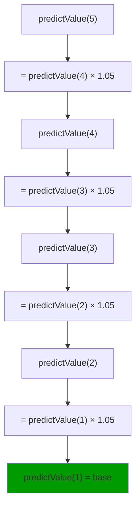

#### Recursion vs Memoization
```mermaid
flowchart TD
    subgraph Without Memoization O(2^n)
        A[fib(5)] --> B[fib(4)] & C[fib(3)]
        B --> D[fib(3)] & E[fib(2)]
        C --> F[fib(2)] & G[fib(1)]
        D --> H[fib(2)] & I[fib(1)]
        style D fill:#f96
        style C fill:#f96
    end
    
    subgraph With Memoization O(n)
        J[fib(5)] --> K[fib(4)] --> L[fib(3)] --> M[fib(2)] --> N[fib(1)]
        L -.->|cached| O[fib(2) from cache]
        K -.->|cached| P[fib(3) from cache]
    end
```

---
## Part 2: Design Patterns & Principles

### 1. Singleton Pattern
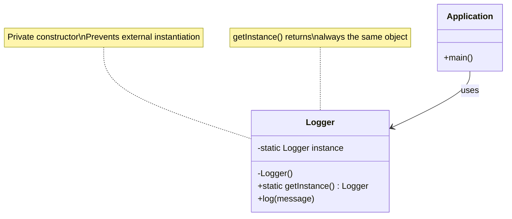

```mermaid
flowchart TD
    A[App calls Logger.getInstance()] --> B{Instance exists?}
    B -->|No| C[Create new Logger instance]
    B -->|Yes| D[Return existing instance]
    C --> E[Store in static field]
    E --> D
    D --> F[All parts of app share ONE Logger]
```

---
### 2. Factory Method Pattern
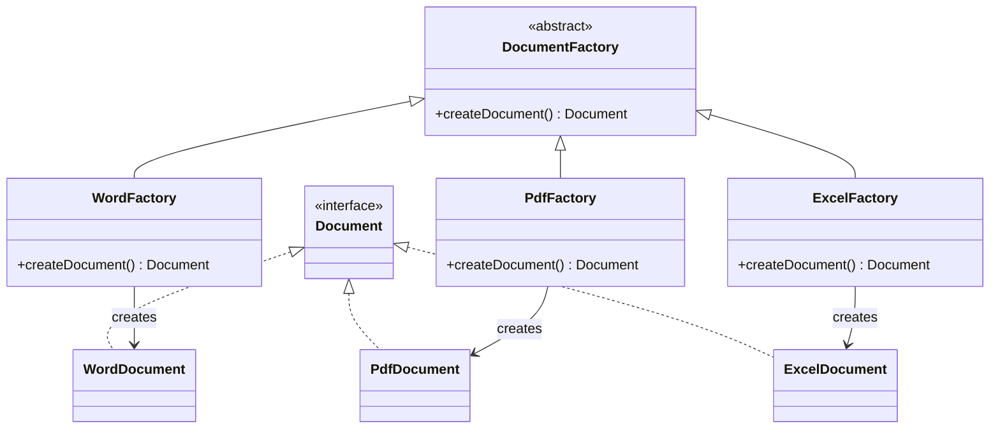

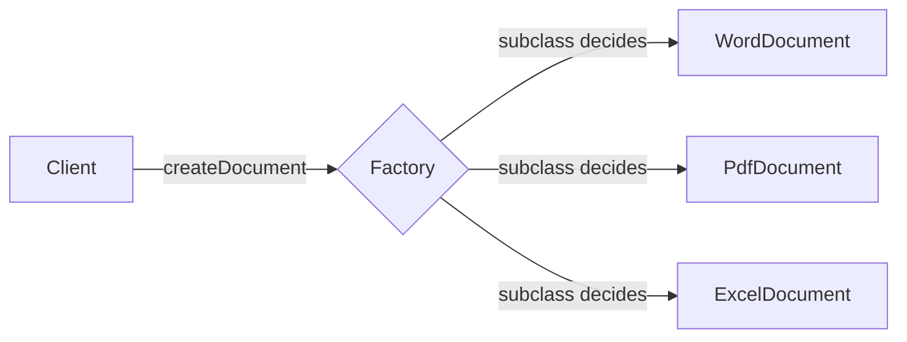

---
### 3. Builder Pattern
```mermaid
classDiagram
    class Computer {
        -String CPU
        -String RAM
        -String storage
        -String GPU
        -boolean bluetooth
        -Computer(Builder b)
    }
    
    class Builder {
        -String CPU
        -String RAM
        -String storage
        -String GPU
        -boolean bluetooth
        +setCPU(String) Builder
        +setRAM(String) Builder
        +setStorage(String) Builder
        +setGPU(String) Builder
        +setBluetooth(boolean) Builder
        +build() Computer
    }
    
    Computer "1" --> "1" Builder : contains
    
    note for Builder "Fluent API: each setter returns 'this'"
    note for Computer "Private constructor\nOnly Builder creates"
```

```mermaid
flowchart LR
    A["new Computer.Builder()"] --> B[.setCPU'i7']
    B --> C[.setRAM'16GB']
    C --> D[.setStorage'512GB SSD']
    D --> E[.build]
    E --> F[Computer object]
    
    style E fill:#090,stroke:#090
```

---
### 4. Adapter Pattern
```mermaid
classDiagram
    class PaymentProcessor {
        <<interface>>
        +processPayment(double)
    }
    
    class PayPalAdapter {
        -PayPalGateway payPal
        +processPayment(double)
    }
    
    class CreditCardAdapter {
        -CreditCardGateway cc
        +processPayment(double)
    }
    
    PaymentProcessor <|.. PayPalAdapter
    PaymentProcessor <|.. CreditCardAdapter
    
    class PayPalGateway {
        +makePayment(double)
    }
    class CreditCardGateway {
        +charge(double)
    }
    
    PayPalAdapter --> PayPalGateway : adapts
    CreditCardAdapter --> CreditCardGateway : adapts
```

```mermaid
flowchart LR
    Client -->|processPayment()| Adapter[Adapter]
    Adapter -->|translate call| Gateway1[PayPal: makePayment()]
    Adapter -->|translate call| Gateway2[CreditCard: charge()]
    Adapter -->|translate call| Gateway3[Stripe: pay()]
    
    note[Adapter translates common interface\nto each gateway's specific API]
```

---
### 5. Decorator Pattern
```mermaid
classDiagram
    class Notifier {
        <<interface>>
        +send(String)
    }
    
    class EmailNotifier {
        +send(String)
    }
    
    class NotifierDecorator {
        -Notifier wrapper
        +send(String)
    }
    <<abstract>> NotifierDecorator
    
    class SMSDecorator {
        +send(String)
    }
    class SlackDecorator {
        +send(String)
    }
    
    Notifier <|.. EmailNotifier
    Notifier <|.. NotifierDecorator
    NotifierDecorator <|-- SMSDecorator
    NotifierDecorator <|-- SlackDecorator
    NotifierDecorator o--> Notifier : wraps
```

```mermaid
flowchart LR
    A[EmailNotifier] -->|wrapped by| B[SMSDecorator]
    B -->|wrapped by| C[SlackDecorator]
    C -->|called: send'Alert'| B
    B -->|sends SMS + delegates to| A
    A -->|sends Email|
    
    note["Result: Alert sent via Email + SMS + Slack"]
```

---
### 6. Proxy Pattern
```mermaid
classDiagram
    class Image {
        <<interface>>
        +display()
    }
    
    class RealImage {
        -String filename
        +RealImage(String)
        +display()
        -loadFromServer()
    }
    
    class ProxyImage {
        -RealImage realImage
        -String filename
        +display()
    }
    
    Image <|.. RealImage
    Image <|.. ProxyImage
    ProxyImage --> RealImage : holds reference
```

```mermaid
sequenceDiagram
    participant Client
    participant Proxy as ProxyImage
    participant Real as RealImage
    
    Client->>Proxy: display()
    alt First time
        Proxy->>Real: new RealImage()
        Real->>Real: loadFromServer() [slow]
        Real->>Proxy: return image
        Proxy->>Client: display image
    else Subsequent times
        Proxy->>Real: display() [cached]
        Real->>Client: display image [fast]
    end
```

---
### 7. Observer Pattern
```mermaid
classDiagram
    class Stock {
        <<interface>>
        +registerObserver(Observer)
        +removeObserver(Observer)
        +notifyObservers()
    }
    
    class StockMarket {
        -List~Observer~ observers
        -double price
        +registerObserver(Observer)
        +removeObserver(Observer)
        +notifyObservers()
        +setPrice(double)
    }
    
    class Observer {
        <<interface>>
        +update(double)
    }
    
    class MobileApp {
        +update(double)
    }
    class WebApp {
        +update(double)
    }
    
    Stock <|.. StockMarket
    Observer <|.. MobileApp
    Observer <|.. WebApp
    StockMarket o--> Observer : notifies
```

```mermaid
sequenceDiagram
    participant Market as StockMarket
    participant App1 as MobileApp
    participant App2 as WebApp
    
    Market->>App1: registerObserver()
    Market->>App2: registerObserver()
    
    Market->>Market: price changes to 150
    Market->>App1: update(150)
    Market->>App2: update(150)
    App1->>App1: Display new price
    App2->>App2: Display new price
```

---
### 8. Strategy Pattern
```mermaid
classDiagram
    class PaymentStrategy {
        <<interface>>
        +pay(double)
    }
    
    class CreditCardPayment {
        +pay(double)
    }
    class PayPalPayment {
        +pay(double)
    }
    class CryptoPayment {
        +pay(double)
    }
    
    class PaymentContext {
        -PaymentStrategy strategy
        +setStrategy(PaymentStrategy)
        +executePayment(double)
    }
    
    PaymentStrategy <|.. CreditCardPayment
    PaymentStrategy <|.. PayPalPayment
    PaymentStrategy <|.. CryptoPayment
    PaymentContext o--> PaymentStrategy
```

```mermaid
flowchart LR
    A[PaymentContext] -->|uses| B{PaymentStrategy}
    B -->|switch at runtime| C[CreditCardPayment]
    B -->|switch at runtime| D[PayPalPayment]
    B -->|switch at runtime| E[CryptoPayment]
    
    A -.->F["executePayment(100)"]
    F --> G["strategy.pay(100)"]
```

---
### 9. Command Pattern
```mermaid
classDiagram
    class Command {
        <<interface>>
        +execute()
    }
    
    class LightOnCommand {
        -Light light
        +execute()
    }
    class LightOffCommand {
        -Light light
        +execute()
    }
    
    class RemoteControl {
        -Command command
        +setCommand(Command)
        +pressButton()
    }
    
    class Light {
        +turnOn()
        +turnOff()
    }
    
    Command <|.. LightOnCommand
    Command <|.. LightOffCommand
    RemoteControl o--> Command
    LightOnCommand --> Light
    LightOffCommand --> Light
```

```mermaid
sequenceDiagram
    participant User
    participant Remote as RemoteControl
    participant Cmd as LightOnCommand
    participant Light
    
    User->>Remote: setCommand(onCmd)
    User->>Remote: pressButton()
    Remote->>Cmd: execute()
    Cmd->>Light: turnOn()
    Light-->>User: Light is ON
```

---
### 10. MVC Pattern
```mermaid
classDiagram
    class StudentModel {
        -String name
        -int id
        -String grade
        +getName()
        +setName(String)
        +getId()
        +setId(int)
        +getGrade()
        +setGrade(String)
    }
    
    class StudentView {
        +displayDetails(String, int, String)
    }
    
    class StudentController {
        -StudentModel model
        -StudentView view
        +setStudentName(String)
        +setStudentGrade(String)
        +updateView()
    }
    
    StudentController --> StudentModel
    StudentController --> StudentView
```

```mermaid
flowchart TD
    U[User Input] --> C[Controller]
    C -->|updates| M[Model]
    M -->|notifies| C
    C -->|reads model & updates| V[View]
    V -->|displays to| User
    
    subgraph Separation of Concerns
        M
        V
        C
    end
    
    note["Controller handles input & logic<br/>Model holds data<br/>View handles presentation"]
```

---
### 11. Dependency Injection
```mermaid
classDiagram
    class CustomerRepository {
        <<interface>>
        +findCustomerById(String) Customer
    }
    
    class CustomerRepositoryImpl {
        +findCustomerById(String) Customer
    }
    
    class CustomerService {
        -CustomerRepository repo
        +CustomerService(CustomerRepository)
        +getCustomer(String) Customer
    }
    
    CustomerRepository <|.. CustomerRepositoryImpl
    CustomerService --> CustomerRepository : injected via constructor
```

```mermaid
flowchart LR
    A[Application] -->|creates| B[CustomerRepositoryImpl]
    A -->|injects into| C[CustomerService Constructor]
    C --> D["getCustomer() uses repo"]
    D --> B
    
    style B fill:#090,stroke:#090
    style C fill:#069,stroke:#069
    
    note["Dependency Injection: 'Don't create, receive it'"]
    note["Benefits: Loose coupling, easier testing (mocks)"]
```

---
## Key Takeaways

### Complexity Cheat Sheet
```mermaid
graph TD
    subgraph Time Complexities
        O1["O(1) - Constant"] --> Eg1["Array access, HashMap get"]
        OL["O(log n) - Logarithmic"] --> Eg2["Binary Search"]
        ON["O(n) - Linear"] --> Eg3["Linear Search, Array traversal"]
        ONL["O(n log n) - Linearithmic"] --> Eg4["Quick Sort, Merge Sort"]
        ON2["O(n²) - Quadratic"] --> Eg5["Bubble Sort, Nested loops"]
    end
```

### Pattern Classification
```mermaid
graph TD
    P[Design Patterns] --> C[Creational]
    P --> S[Structural]
    P --> B[Behavioral]
    P --> A[Architectural]
    
    C --> Singleton
    C --> FactoryMethod
    C --> Builder
    
    S --> Adapter
    S --> Decorator
    S --> Proxy
    
    B --> Observer
    B --> Strategy
    B --> Command
    
    A --> MVC
    A --> DI[Dependency Injection]
```
