# Git Hands-On Learning - Summary

## HOL 1: Git Setup & First Repository

### Git Lifecycle Flow
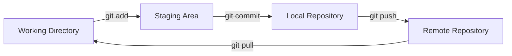

### Configure Git
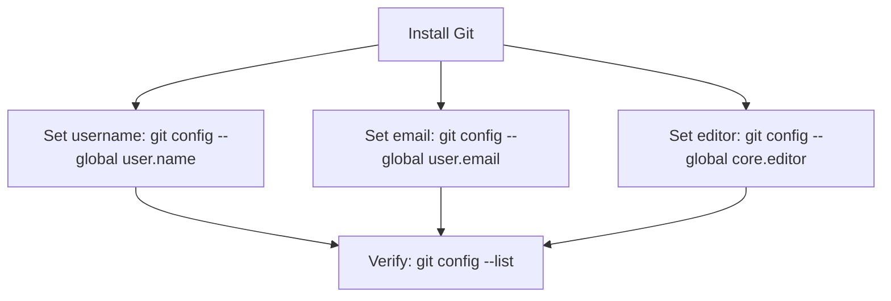

### Init & First Commit
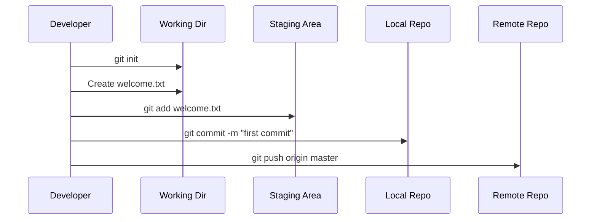

---
## HOL 2: .gitignore

### How .gitignore Filters Files
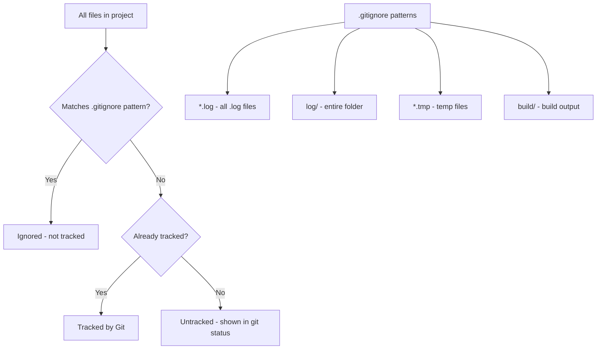

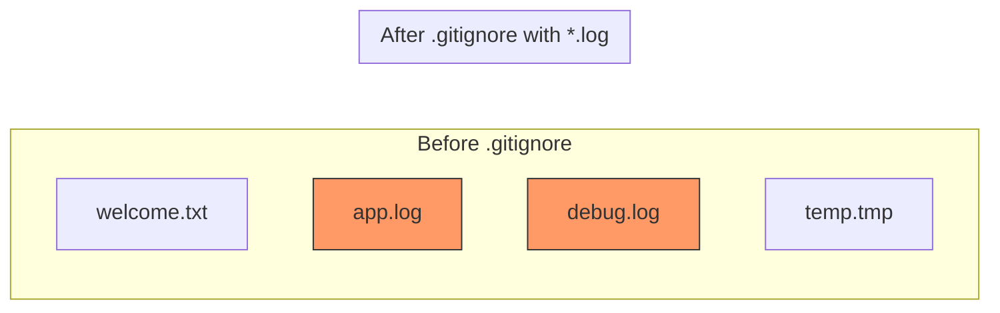

---
## HOL 3: Branching & Merging

### Branch Structure Visualization
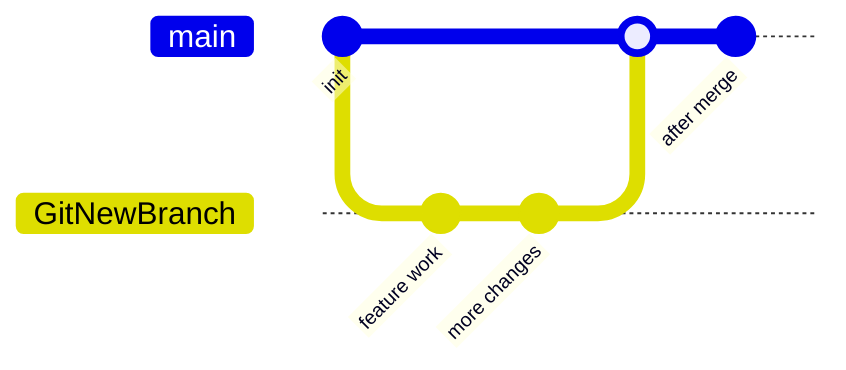

### Branch & Merge Commands Flow
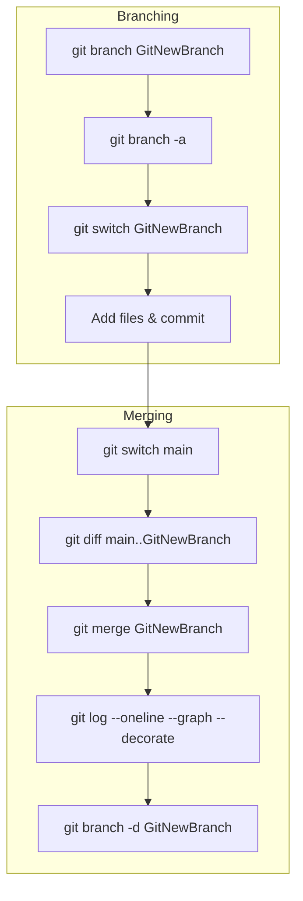

### Diff Visualization
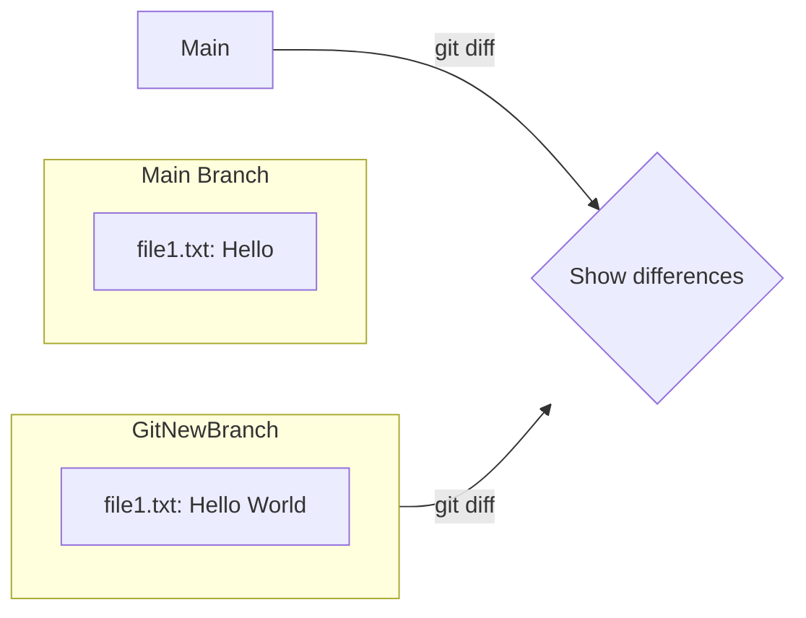

---
## HOL 4: Merge Conflict Resolution

### Conflict Scenario
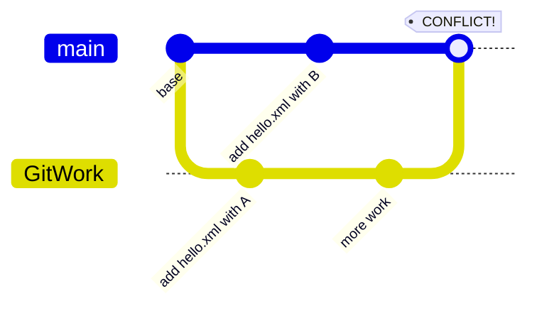

### Conflict Markers
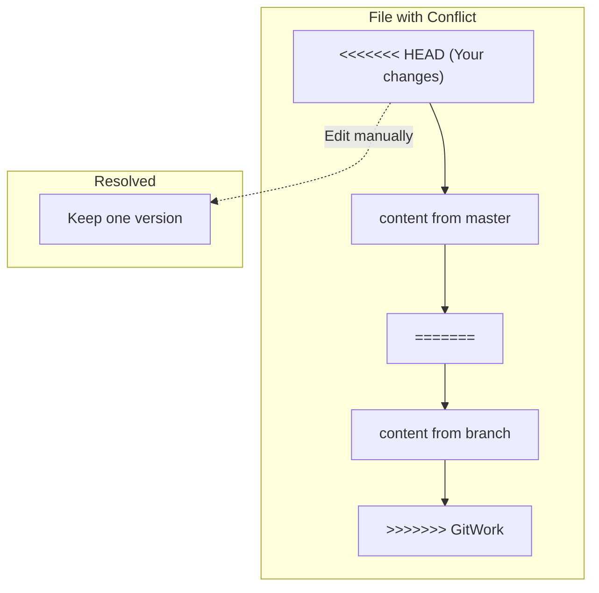

### Conflict Resolution Process
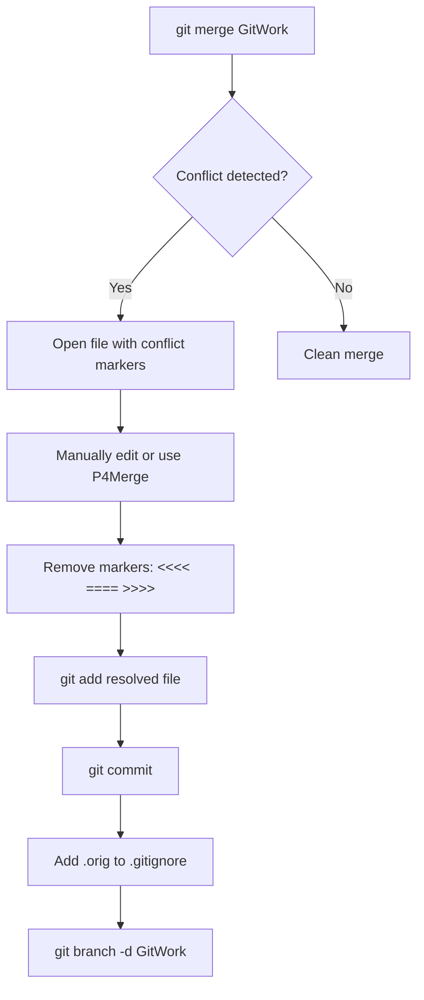

---
## HOL 5: Cleanup & Push to Remote

### Remote Sync Flow
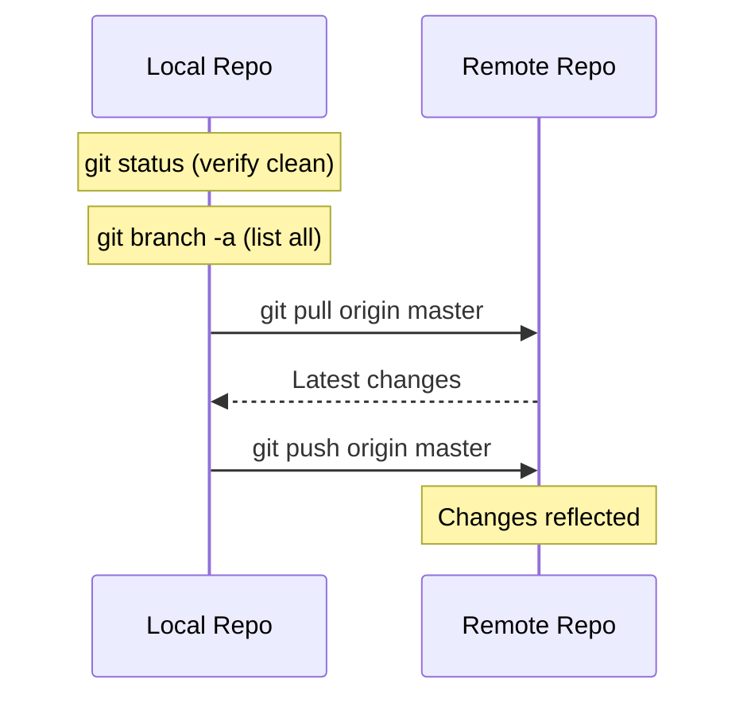

### Complete Git Workflow Overview
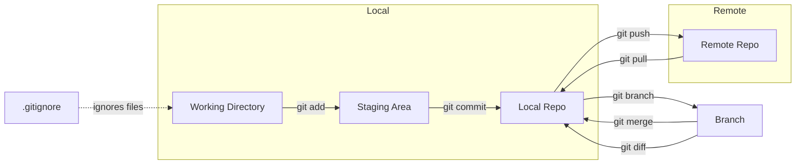

---
## Key Git Commands Reference

| Command | Purpose | Diagram |
|---------|---------|---------|
| `git init` | Initialize a new Git repo | Start of workflow |
| `git status` | Show working tree state | Checkpoint |
| `git add <file>` | Stage file for commit | WD → Staging |
| `git commit -m "msg"` | Commit staged changes | Staging → Local |
| `git branch <name>` | Create a new branch | Fork timeline |
| `git checkout <branch>` | Switch to a branch | Move pointer |
| `git merge <branch>` | Merge branch into current | Join timelines |
| `git pull origin main` | Fetch + merge from remote | Remote → Local |
| `git push origin main` | Push local → remote | Local → Remote |
| `git log --oneline --graph` | View commit history visually | Timeline view |
| `git diff` | Show differences | Compare versions |
